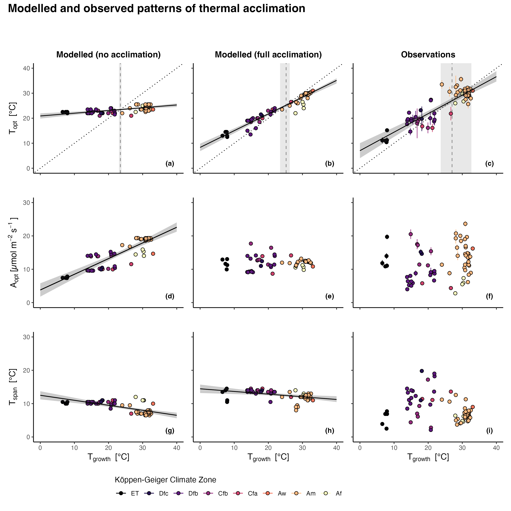

# Global Photosynthesis Acclimates to Rising Temperatures Through Predictable Changes in Photosynthetic Capacities, Stomatal Sensitivity and Enzyme Kinetics

{Citation to be added after publication}

## Abstract

Thermal acclimation allows plants to adjust to seasonal temperature variations and, possibly, to grad- ual warming of similar magnitude. However, current Earth System Models (ESMs) rarely account for thermal acclimation, causing them to potentially overestimate a warming-induced reduction of the future terrestrial carbon uptake.

Using an optimality-based photosynthesis model and a dataset of leaf measurements from globally distributed sites, we compared modelled against observed relationships between a site's growth air tem- perature (Tgrowth) and the optimal temperature of photosynthesis (Topt), respectively, the net assimilation rate at Topt (Aopt). We investigated how these relationships emerge from three main acclimation pro- cesses: Acclimation of (1) the photosynthetic capacities (base rates of carboxylation, electron transport and respiration), (2) stomatal sensitivity to vapour pressure deficit, and (3) enzymatic response of car- boxylation and electron transport.

All three acclimation processes were necessary to predict Topt accurately (R2 = 0.74), resulting in a modelled increase with Tgrowth of 0.67 °C/°C. Assuming optimal acclimation to the environment to predict the photosynthetic capacities was crucial to reproduce the observation that Aopt does not corre- late significantly with Tgrowth. In contrast, using fixed plant-specific parameters for the photosynthetic capacities imposed a biased increase of Aopt with Tgrowth. By simulating warming trajectories of a 5 °C increase in Tgrowth, we found that neglecting acclimation predicts substantial changes in net assimila- tion rates of +24% in arctic and -34% in tropical ecosystems, whereas considering all three acclimation processes predicts a change of only +12%, respectively, -5%.

Our study demonstrates that thermal acclimation is predictable from the environment and that it enables plants globally to operate relatively close to their optimum temperature. We propose a process- based and robust implementation of thermal acclimation that, if adopted in ESMs, should predict a more resilient terrestrial carbon cycle than what is suggested by current implementations that rely on fixed plant-specific parameters.

*Figure 01: Modelled and observed patterns of each trait against Tgrowth. Rows denote the three traits: Topt (a, b, c), Aopt (d, e, f), and Tspan (g, h, i). Columns denote the source of the shown trait: model setup without acclimation (a, d, g), full model setup (b, e, h), and observations (c, f, i). For observations, the error bars reflect standard errors (observations for Tspan have no error bars because it was back-calculated, see Section 2.3). Black solid lines and surrounding grey areas are linear regressions with their 95% confidence intervals (only shown if significant at p \< 0.01). Vertical grey dashed lines in the top row show the intersection point at which Topt = Tgrowth and the surrounding grey area denotes the intersection of the linear regression's upper and lower 95% confidence interval with the dotted one-to-one line. Colours denote the Koeppen-Geiger climate zone classification: Af = Equatorial rainforest, Am = Equatorial monsoon, Aw = Equatorial savannah with dry winter, Cfa = Warm temperate fully humid with hot summer, Cfb = Warm temperate fully humid with warm summer, Dfb = Snow climate fully humid with warm summer, Dfc = Snow climate fully humid with cool summer, ET = Polar tundra (Kottek et al., 2006).*

------------------------------------------------------------------------

## Reproducibility

> If you encounter issues to reproduce any results, please raise a GitHub issue.

This repository includes all code, data, and instructions to reproduce the papers's results. It is organized as follows:

-   `R` - overall functions which are recycled.
-   `data` - includes the scripts for data cleaning and the clean data which is used in analysis.
-   `analysis` - includes the scripts for data analysis.
-   `manuscript` - includes outputs that appear in the manuscript
-   `output` - is populated with output when running the scripts under `analysis`

### Setup to reproduce results

1.  Download required data

    1.  Download [ACi-TGlob_V1.0](https://figshare.com/articles/dataset/ACi-TGlob_V1_0_A_Global_dataset_of_photosynthetic_CO2_response_curves_of_terrestrial_plants_/7283567) and add it to `data/raw/.`

    2.  From the bitbucket repository [photom](https://bitbucket.org/Kumarathunge/photom/src/master/), download the two files [`Arctic_A-Ci_curves_2012-2015_V2.csv`](https://bitbucket.org/Kumarathunge/photom/raw/d015fd064de78288a1d07abbbd99f02e13a81e8b/Data/Arctic_A-Ci_curves_2012-2015_V2.csv) and [`SPRUCE_3_cohort_ACi_data.csv`](https://bitbucket.org/Kumarathunge/photom/raw/d015fd064de78288a1d07abbbd99f02e13a81e8b/Data/SPRUCE_3_cohort_ACi_data.csv). Place them under `data/raw/files_from_photom_repo/.`

    3.  For plotting global maps, the repository provides GIS data in `data/climate_zones` as freely available from [here](http://koeppen-geiger.vu-wien.ac.at/shifts.htm) (see bottom of page).

2.  Setting up the R environment

    1.  Make sure to have [{renv}](https://rstudio.github.io/renv/articles/renv.html) installed

    2.  Open `thermacc.Rproj`

    3.  If {renv} does not prompt updating packages automatically, run `renv::restore()`

    4.  Run `source("R/source.R")` to load all packages and functions. Make sure that all required packages are installed.

3.  Run code to generate data necessary for analysis

    1.  `01_wrangling_ACi-TGlob_V1.0.R` wrangles the raw data and creates the final dataset used in the remaining analysis. To run the full script, make sure to have downloaded the data as specified above.

    2.  `02_get_climate_data.R` gets all climatic drivers to run the P-Model and `03_process_forcing_data` processes this data. The code relies on large datasets (WorldClim, WATCH-WFDE5, ETOPO) and to have {[ingestr](https://github.com/geco-bern/ingestr)} installed. Because of these dependencies, we provide the final file used for all further analysis directly (`k19_sitename_siteinfo_forcing_hh.rds`).

### Description of files for reproducing results

-   `03_model_sensitivity_analysis.R` conducts the model sensitivity analysis.
-   `04_isolated_processes.R` runs all model setups with none, some, and all acclimation processes; and creates respective outputs.
-   `05_warming_trajectories.R` runs warming trajectories for one representative site per climate zone for the different model setups; and creates respective outputs.
-   `06_additional_analyses.R` runs additional analyses and tests to support results (e.g., verification of VPD-scaling approach).
-   `07_seasonality-of-traits.R` runs seaonal prediction of thermal acclimation.
