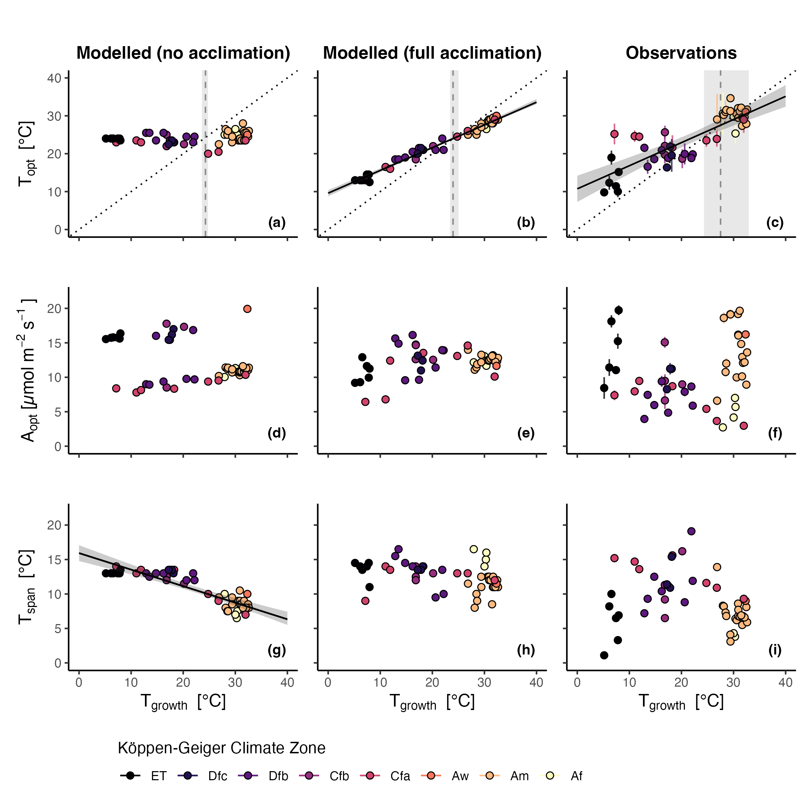

# Global Photosynthesis Acclimates to Rising Temperatures Through Predictable Changes in Photosynthetic Capacities, Stomatal Sensitivity and Enzyme Kinetics

{Citation to be added after publication}

## Abstract

Plants can adjust their photosynthetic processes in response to gradual temperature changes over a period of weeks, a mechanism known as thermal acclimation. This acclimation may help plants mitigate the impacts of global warming, but many models simulating the response of vegetation to a changing climate do not fully incorporate it.
In this study, we tested a photosynthesis model that predicts a plant's response to gradual temperature changes based on general principles rather than specific plant types. These principles, stemming from optimality theory and fundamental biochemistry, describe thermal acclimation through different internal processes that regulate the use of carbon, water, and energy. We compared the model with a global dataset of leaf measurements to disentangle the influence of these different processes on photosynthesis.
We found that to accurately predict observed patterns, it was essential to include three acclimation processes: adjustments in photosynthetic capacities, enzyme activities, and stomatal response to air dryness. The model showed that thermal acclimation buffers plants against the effect of global warming, leading to smaller increases in photosynthesis in cold climates and smaller declines in warm climates compared to models without acclimation.
This study highlights the importance of incorporating thermal acclimation into vegetation models to improve predictions of plant responses under future climate scenarios.

*Graphical Abstract: Modelled and observed patterns of photosynthetic traits against $T_{\text{growth}}$. Rows denote the three traits: $T_{\text{opt}}$ (a, b, c), $A_{\text{opt}}$ (d, e, f), and $T_{\text{span}}$ (g, h, i). Columns denote the source of the shown trait: model setup without acclimation (a, d, g), full model setup (b, e, h), and observations (c, f, i). For observations, the error bars reflect standard errors (observations for $T_{\text{span}}$ have no error bars because they were back-calculated from fitted response curves; see Section \ref{sec:observational-data}). Black solid lines and surrounding grey areas are linear regressions with 95\% confidence intervals (only shown if significant at $p < 0.01$; for values, see Table \ref{tab:acclimation-rates}). Vertical grey dashed lines in the top row show the intersection point at which $T_{\text{opt}} = T_{\text{growth}}$ and the surrounding grey area denotes the intersection of the linear regression's upper and lower 95\% confidence interval with the dotted one-to-one line. Colours denote the Koeppen-Geiger climate zone classification: Af = Equatorial rainforest, Am = Equatorial monsoon, Aw = Equatorial savannah with dry winter, Cfa = Warm temperate fully humid with hot summer, Cfb = Warm temperate fully humid with warm summer, Dfb = Snow climate fully humid with warm summer, Dfc = Snow climate fully humid with cool summer, ET = Polar tundra \citep{kottek2006}.*

------------------------------------------------------------------------

## Reproducibility

> If you encounter issues to reproduce any results, please raise a GitHub issue.

This repository includes all code, data, and instructions to reproduce the papers's results. It is organized as follows:

-   `R` - overall functions which are recycled.
-   `data` - includes the scripts for data cleaning and the clean data which is used in analysis.
-   `analysis` - includes the scripts for data analysis.
-   `manuscript` - includes outputs that appear in the manuscript
-   `output` - is populated with output when running the scripts under `analysis`

### Setup to reproduce results

1.  Download required data

    1.  Download [ACi-TGlob_V1.0](https://figshare.com/articles/dataset/ACi-TGlob_V1_0_A_Global_dataset_of_photosynthetic_CO2_response_curves_of_terrestrial_plants_/7283567) and add it to `data/raw/.`

    2.  From the bitbucket repository [photom](https://bitbucket.org/Kumarathunge/photom/src/master/), download the two files [`Arctic_A-Ci_curves_2012-2015_V2.csv`](https://bitbucket.org/Kumarathunge/photom/raw/d015fd064de78288a1d07abbbd99f02e13a81e8b/Data/Arctic_A-Ci_curves_2012-2015_V2.csv) and [`SPRUCE_3_cohort_ACi_data.csv`](https://bitbucket.org/Kumarathunge/photom/raw/d015fd064de78288a1d07abbbd99f02e13a81e8b/Data/SPRUCE_3_cohort_ACi_data.csv). Place them under `data/raw/files_from_photom_repo/.`

    3.  For plotting global maps, the repository provides GIS data in `data/climate_zones` as freely available from [here](http://koeppen-geiger.vu-wien.ac.at/shifts.htm) (see bottom of page).

2.  Setting up the R environment

    1.  Make sure to have [{renv}](https://rstudio.github.io/renv/articles/renv.html) installed

    2.  Open `thermacc.Rproj`

    3.  If {renv} does not prompt updating packages automatically, run `renv::restore()`

    4.  Run `source("R/source.R")` to load all packages and functions. Make sure that all required packages are installed.

3.  Run code to generate data necessary for analysis

    1.  `01_wrangling_ACi-TGlob_V1.0.R` wrangles the raw data and creates the final dataset used in the remaining analysis. To run the full script, make sure to have downloaded the data as specified above.

    2.  `02_get_climate_data.R` gets all climatic drivers to run the P-Model and `03_process_forcing_data` processes this data. The code relies on large datasets (WorldClim, WATCH-WFDE5, ETOPO) and to have {[ingestr](https://github.com/geco-bern/ingestr)} installed. Because of these dependencies, we provide the final file used for all further analysis directly (`k19_sitename_siteinfo_forcing_hh.rds`).

### Description of files for reproducing results

-   `03_model_sensitivity_analysis.R` conducts the model sensitivity analysis.
-   `04_isolated_processes.R` runs all model setups with none, some, and all acclimation processes; and creates respective outputs.
-   `05_warming_trajectories.R` runs warming trajectories for one representative site per climate zone for the different model setups; and creates respective outputs.
-   `06_seasonality-of-traits.R` runs seaonal prediction of thermal acclimation.
-   `07_additional_analyses.R` runs additional analyses and tests to support results (e.g., verification of VPD-scaling approach).
